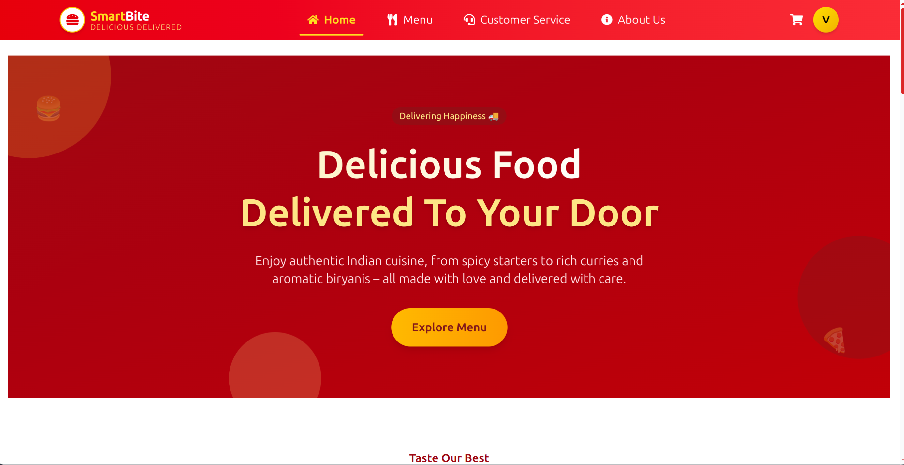
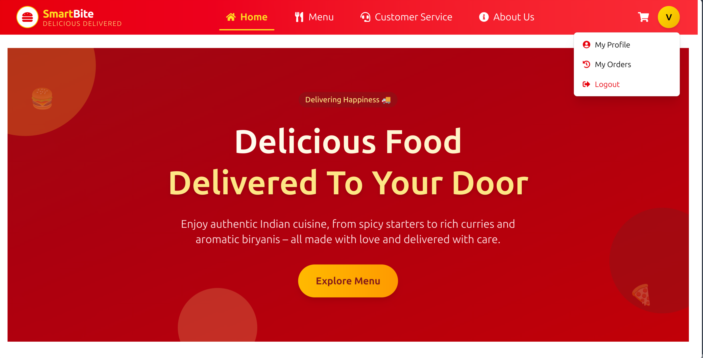
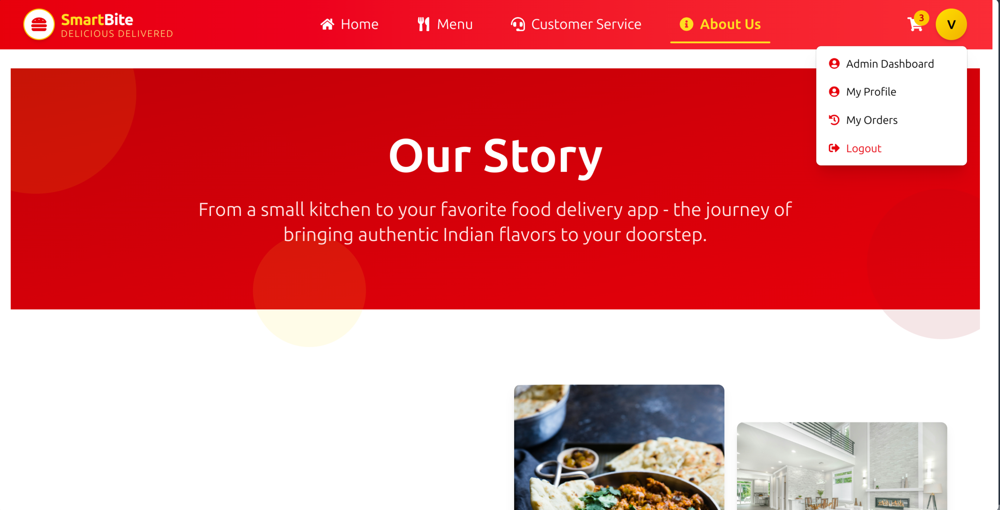
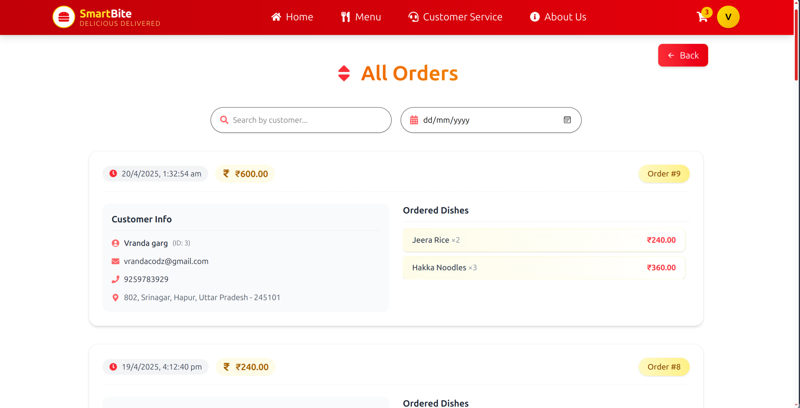
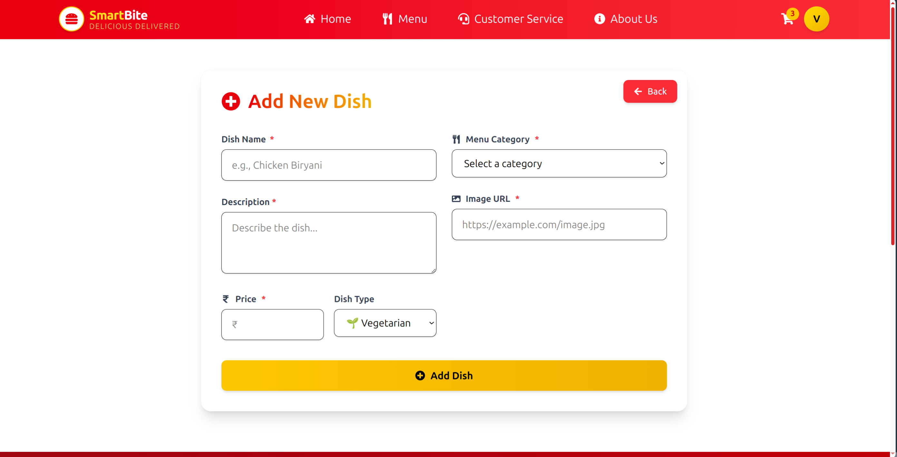
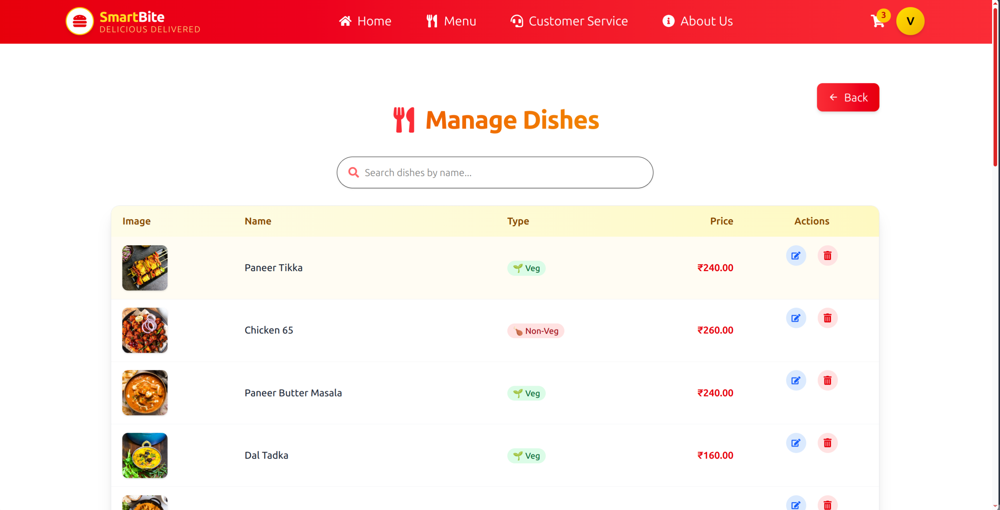
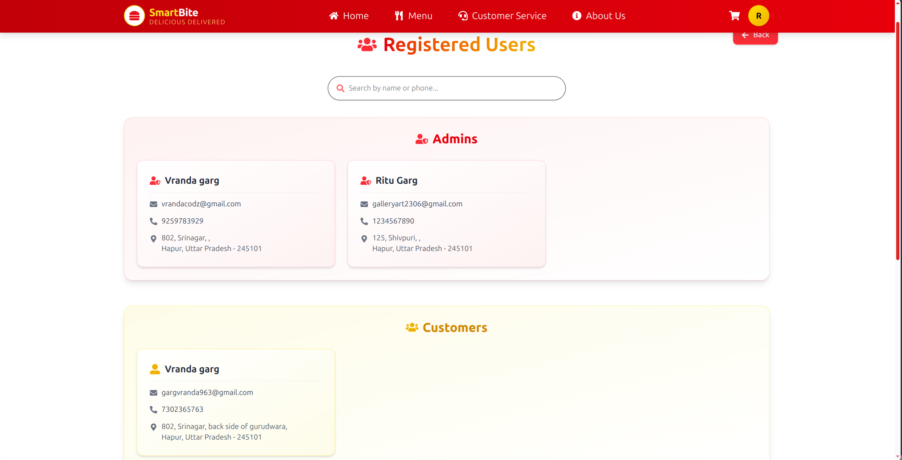
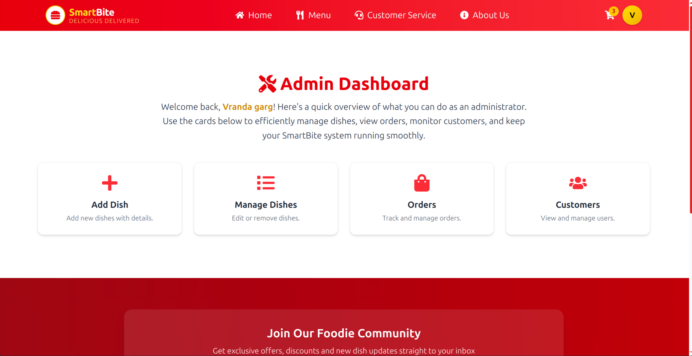

# 🍔 SmartBite – Your Personal Restaurant Ordering Website

**SmartBite** is a full-stack restaurant food ordering system tailored for a **single restaurant owner**. From browsing dishes to placing orders, from managing dishes to viewing customers, it handles it all — with an intuitive UI and a smooth, animated experience.

Built using **ReactJS**, **Tailwind CSS**, **Framer Motion** and **Appwrite**, this platform is ideal for food startups and solo restaurant owners looking to digitize their service.

---

## 📸 Project Preview



---

## 👥 Role-Based Access Comparison

| Feature / View                                  | 👤 User                                          | 🛠️ Admin                                             | 👑 Super Admin                                                   |
| ----------------------------------------------- | ------------------------------------------------ | ---------------------------------------------------- | ---------------------------------------------------------------- |
| 🔐 **Access Level**                             | Regular User                                     | Privileged Admin                                     | Top-level Control                                                |
|                                                 | ✅ Profile Dropdown                              | ✅ Profile Dropdown                                  | ✅ Profile Dropdown                                              |
|                                                 |  |    |                |
| 📦 **View All Orders**                          | ❌ Not Accessible                                | ✅ Access to All Orders with Filters                 | ✅ Full Order Access with Filters                                |
|                                                 |                                                  |                |                            |
| 🍽️ **Manage Dishes**                            | ❌ No Access                                     | ✅ Full Control                                      | ✅ Full Control                                                  |
|                                                 |                                                  |                |                            |
|                                                 |                                                  |          |                      |
| 👥 **View Customers & Promote / Demote Admins** | ❌ No Access                                     | ✅ View-Only Access                                  | ✅ Full Access                                                   |
|                                                 |                                                  |  |  |
| 🎛️ **Admin Dashboard**                          | ❌ Hidden                                        | ✅ Access Granted                                    | ✅ Access + Admin Management Tools                               |

## Admin & Super Admin Dashboard

## 

## 📸 Visual Feature Comparison

## 🚀 Features

### 🧑 User Side

- ✅ **Authentication** (Login, Signup, Forgot/Reset Password), **MySQL**
- 🛒 **Cart System** with quantity control, subtotal, tax & delivery calculation
- 💳 **Order Placement** with simulated payment methods (COD, UPI, Card)
- 📜 **Order History** with option to submit reviews
- ✍️ **Review System** – can write, edit, delete reviews
- ✨ **Smooth Animations** using Framer Motion

### 🛠️ Admin Panel

- ➕ **Add / Edit / Delete Dishes**
- 📦 **View All Orders** – Includes dish details, customer address, payment mode, filter by date/name
- 👥 **View & Manage Customers** – Promote/demote admin (only Super Admin)
- 📧 **Order Notification Emails** _(Optional via EmailJS)_

---

## 🧑‍💻 Tech Stack

### Frontend

- ReactJS
- Tailwind CSS
- Framer Motion
- React Router
- React Icons
- Context API (Cart, Auth, Order, Toast)

### Backend

- Appwrite (Auth and DB)

---

## 🔐 Super Admin Access

Only the **super admin** `hi@vrandagarg.in` can:

- 🔐 Promote other users to admin
- 🔐 Demote admins to users

---

## 📁 Folder Structure

```
SmartBite/
│──src/
│   ├── Pages/
│   ├── Admin/
│   ├── Components/
│   ├── Context/
│   ├── Config/
│   ├── assets/
|   │   └── [screenshots, dish images, etc.]
│── public/
│── index.html
│── .env
├── README.md
```

---

## 💡 Future Scope

- ✅ Razorpay / Stripe integration
- 📱 PWA Support
- 📊 Admin dashboard analytics (charts, graphs)
- 📲 Push Notifications
- 🤖 AI Dish Recommendation

---

## 🧑‍🍳 Created With Love By

**Vranda Garg**  
GitHub: [@VrandaaGarg](https://github.com/VrandaaGarg)

> Full-stack Dev 🍔 | Hackathon Enthusiast 💻

---

## 📝 License

This project is open source and free to use for personal or educational purposes.

---
