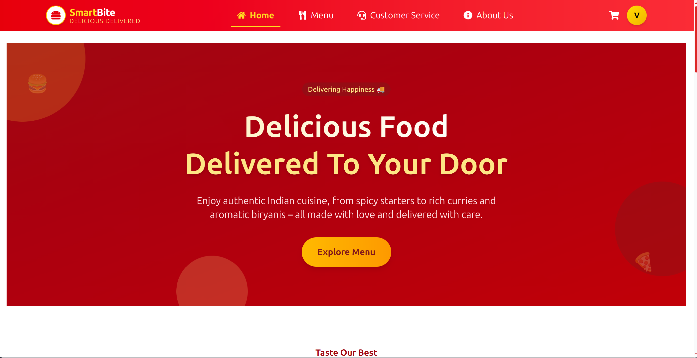
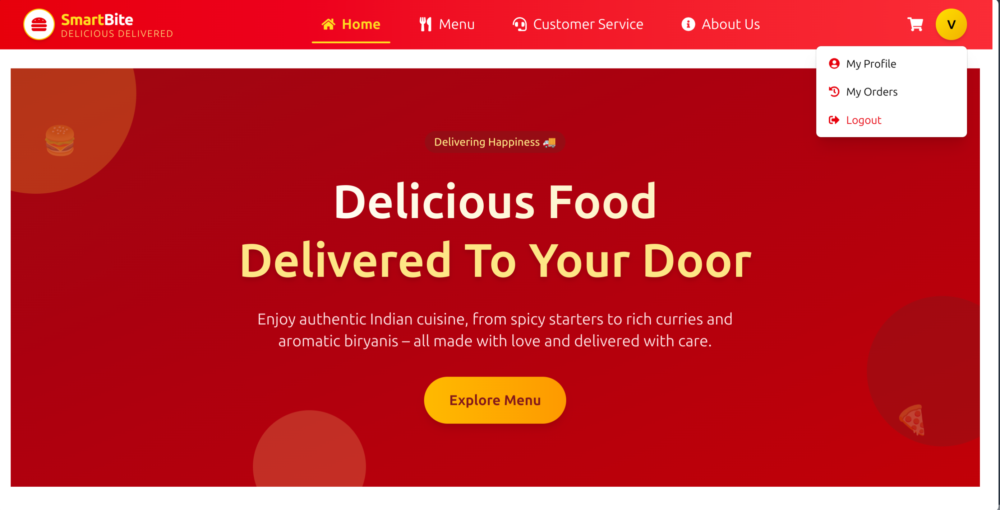
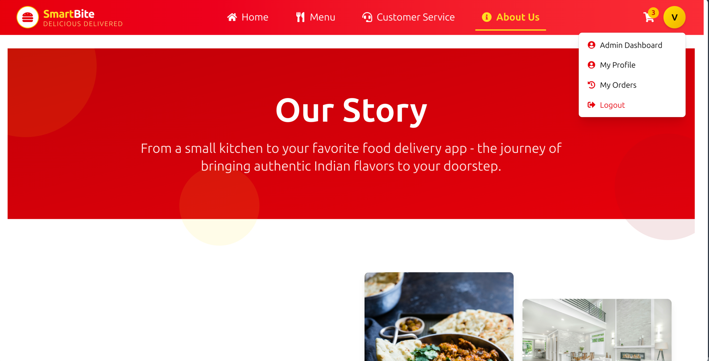
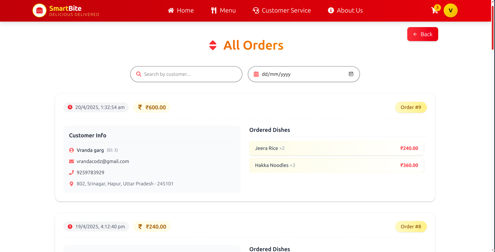
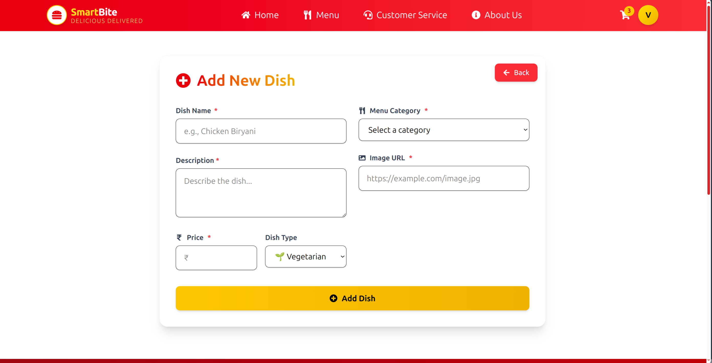
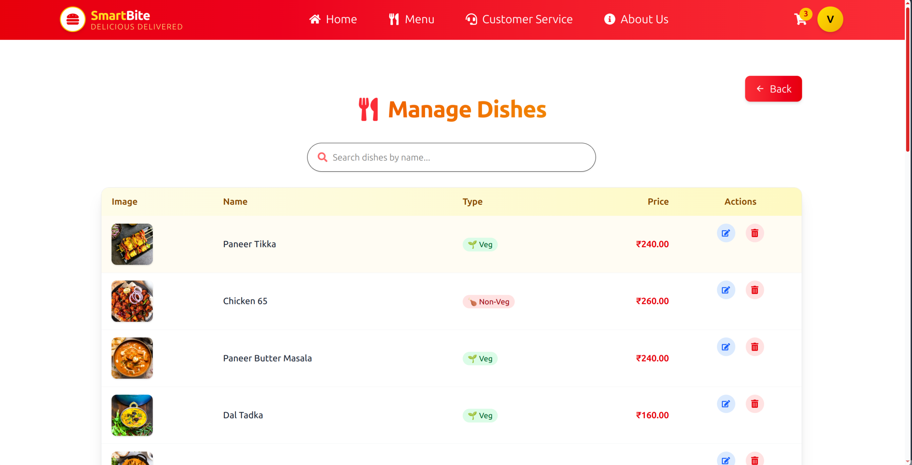
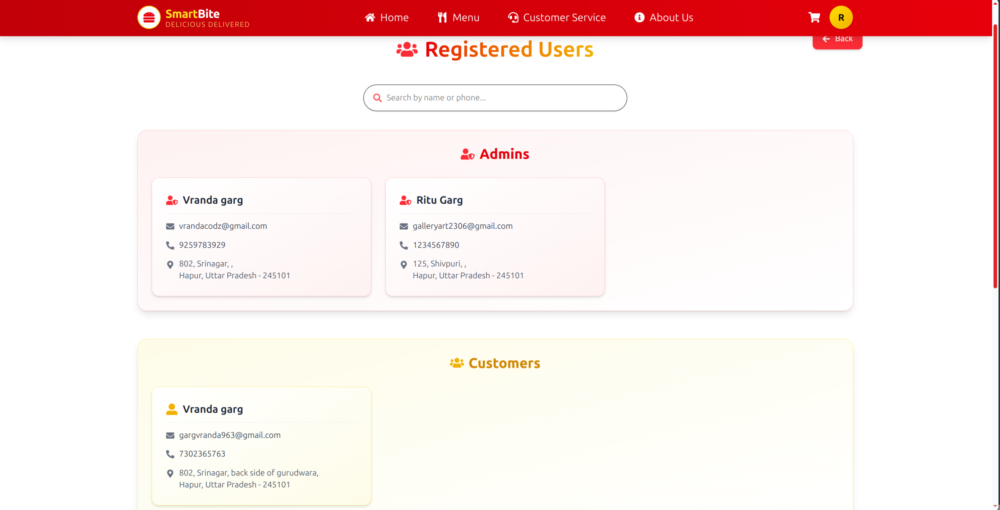
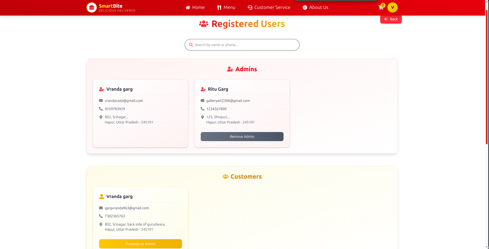
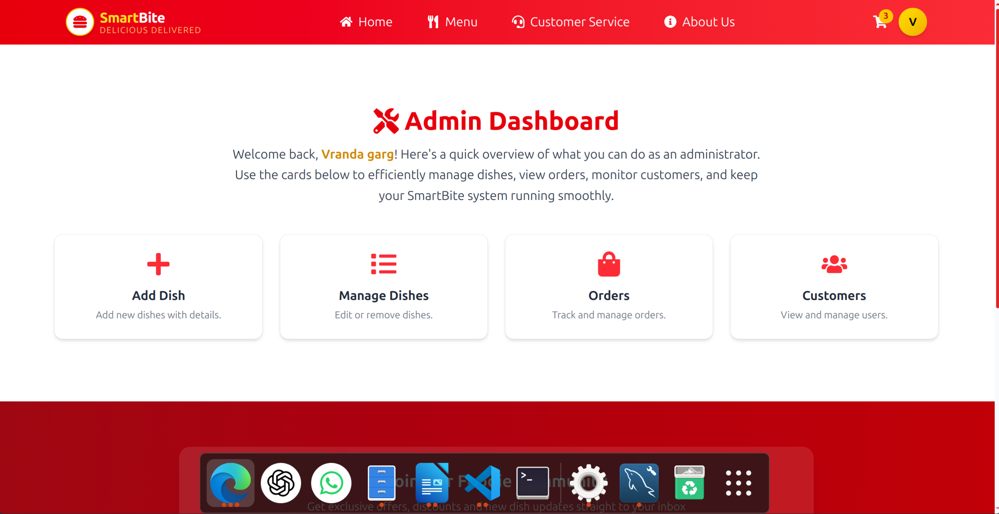

# 🍔 SmartBite – Your Personal Restaurant Ordering Website

**SmartBite** is a full-stack restaurant food ordering system tailored for a **single restaurant owner**. From browsing dishes to placing orders, from managing dishes to viewing customers, it handles it all — with an intuitive UI and a smooth, animated experience.

Built using **ReactJS**, **Tailwind CSS**, **Framer Motion**, **MySQL**, and **Node.js**, this platform is ideal for food startups and solo restaurant owners looking to digitize their service.

---

## 📸 Project Preview


 

---

## 👥 Role-Based Access Comparison

| Feature / View              | 👤 User                          | 🛠️ Admin                             | 👑 Super Admin                         |
|-----------------------------|----------------------------------|-------------------------------------|----------------------------------------|
| 🔐 **Access Level**         | Regular User                    | Privileged Admin                   | Top-level Control                      |
|                             | ✅ Profile Dropdown              | ✅ Profile Dropdown                     | ✅ Profile Dropdown                  |
|                             |  |  |  |
| 📦 **View All Orders**       | ❌ Not Accessible                | ✅ Access to All Orders with Filters            | ✅ Full Order Access with Filters      |
|                             |                                   |  |  |
| 🍽️ **Manage Dishes**        | ❌ No Access                     | ✅ Full Control                                  | ✅ Full Control                        |
|                             |                                   |  |  |
|                             |                                   |  |  |
| 👥 **View Customers & Promote / Demote Admins**        | ❌ No Access                     | ✅ View-Only Access                 | ✅ Full Access                         |
|                             |                                   |  |  |
| 🎛️ **Admin Dashboard**     | ❌ Hidden                        | ✅ Access Granted                   | ✅ Access + Admin Management Tools     |


## Admin & Super Admin Dashboard        
  
---

## 📸 Visual Feature Comparison

## 🚀 Features

### 🧑 User Side
- ✅ **Authentication** (Login, Signup, Forgot/Reset Password)
- 🛒 **Cart System** with quantity control, subtotal, tax & delivery calculation
- 💳 **Order Placement** with simulated payment methods (COD, UPI, Card)
- 📜 **Order History** with option to submit reviews
- ✍️ **Review System** – only for previously ordered dishes
- 🌗 **Light/Dark Theme Toggle** *(optional)*
- ✨ **Smooth Animations** using Framer Motion

### 🛠️ Admin Panel
- ➕ **Add / Edit / Delete Dishes**
- 📦 **View All Orders** – Includes dish details, customer address, payment mode, filter by date/name
- 👥 **View & Manage Customers** – Promote/demote admin (only Super Admin)
- 📧 **Order Notification Emails** *(Optional via EmailJS)*

---

## 🧑‍💻 Tech Stack

### Frontend
- ReactJS
- Tailwind CSS
- Framer Motion
- React Router
- React Icons
- Context API (Cart, Auth, Order, Toast)

### Backend
- Node.js + Express
- MySQL (Relational DB)
- EmailJS (optional)
- JWT Auth (configurable)

---

## 🔐 Super Admin Access

Only the **super admin** `vrandacodz@gmail.com` can:
- 🔐 Promote other users to admin
- 🔐 Demote admins to users

---

## 📁 Folder Structure

```
SmartBite/
├── frontend/
│   ├── src/
│   │   ├── Pages/
│   │   ├── Admin/
│   │   ├── Components/
│   │   ├── Context/
│   │   ├── assets/
|   |   │   └── [screenshots, dish images, etc.]
│   └── public/
│   └── index.html
│   └── .env
├── backend/
│   ├── routes/
│   ├── controllers/
│   ├── middleware/
│   ├── db.js
│   ├── server.js
│   └── .env
├── README.md
```

---

## ⚙️ Setup Instructions

### 1. Clone the Repository

```bash
git clone https://github.com/VrandaaGarg/SmartBite.git
cd smartbite
```

---

### 2. Backend Setup (Node + MySQL)

```bash
cd Backend
npm install
```

Create a `.env` file:

```env
DB_HOST=localhost
DB_USER=root
DB_PASSWORD=yourpassword
DB_NAME=SMARTBITE
JWT_SECRET=smartbite-secret
```

Then run:

```bash
node server.js
```

---

### 3. Frontend Setup (React)

```bash
cd ../Frontend
npm install
npm run dev
```

Create a `.env` file:

```env
VITE_EMAILJS_SERVICE_ID=your-EMAILJS-ID
VITE_EMAILJS_TEMPLATE_ID=Template-ID
VITE_EMAILJS_PUBLIC_KEY=EMAILJS-key
```

---

## 🧪 Demo Credentials

| Role        | Email                    | Password   |
|-------------|--------------------------|------------|
| Customer    | testuser@gmail.com       | 123456     |
| Admin       | admin@gmail.com          | admin123   |
| Super Admin | **vrandacodz@gmail.com** |   ------   |

---

## 💡 Future Scope

- ✅ Razorpay / Stripe integration
- 📱 PWA Support
- 📊 Admin dashboard analytics (charts, graphs)
- 📲 Push Notifications
- 🤖 AI Dish Recommendation

---

## 🧑‍🍳 Created With Love By

**Vranda Garg**  
GitHub: [@VrandaaGarg](https://github.com/VrandaaGarg)

> Full-stack Dev 🍔 | Hackathon Enthusiast 💻 

---

## 📝 License

This project is open source and free to use for personal or educational purposes.

---
